# NPS Aggregated model for targets, simulations and explainability.

In this repository, you'll find a curated collection of Jupyter notebooks, each serving as a vital component in the comprehensive framework designed for predicting, simulating, and providing insights into the Net Promoter Score (NPS) at Iberia. These notebooks encapsulate a series of algorithms and functions meticulously developed to handle various aspects of the NPS analysis pipeline.

From preprocessing raw data to applying sophisticated predictive models, and from running detailed simulations to unraveling the underlying factors influencing customer satisfaction, the contents of this repository are instrumental in steering NPS-related strategic decisions. The assortment of notebooks not only facilitates accurate NPS forecasting but also demystifies the intricacies behind the scores, offering a transparent and interpretable view of the results.

By leveraging the interactive nature of Jupyter notebooks, the repository enables a dynamic environment where stakeholders can observe the effects of different parameters in real-time, thereby fostering an informed and data-driven culture within the organization. This repository is the cornerstone of a robust analytics platform that empowers Iberia to harness the full potential of NPS metrics, ensuring that customer feedback translates into meaningful action and sustained improvement.

## Production Notebooks Section
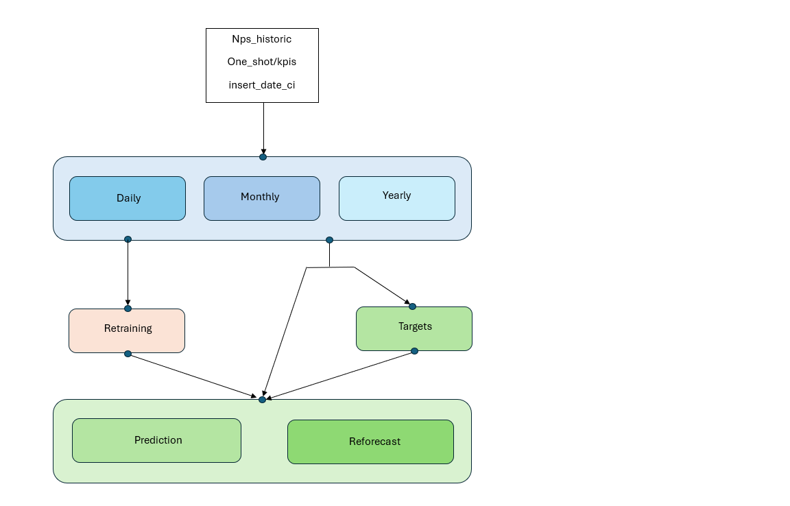

The distilled essence of the research conducted in the Development Notebooks is presented here, divided into three distinct stages:

1. Read and Aggregation Notebooks
This stage includes four structured notebooks, each responsible for:

Extracting data from the latest s3 bucket containing nps_historic and kpis tables.
Aggregating data to derive key variables, primarily focusing on touchpoint satisfactions and Net Promoter Scores (NPS).
Saving the aggregated dataframes as .csv files.
While initial experiments utilized weekly aggregation, the production phase primarily relied on the output from NPS_adjustment_daily. The notebooks NPS_adjustment_monthly and NPS_adjustment_yearly are utilized for providing SHAP value comparisons across different time aggregations. These notebooks also serve as a foundation for estimating targets for the following year, using either autoregressive methods or manual estimations.

An additional "eda" notebook is included, where the time dependencies of the variables were analyzed.

2. Targets Estimation Notebooks
Currently, this stage contains a single "Targets" notebook. This notebook was instrumental in manually estimating the targets for the upcoming year (2024). It draws data from the monthly and yearly adjustments and generates the final dataframe for model predictions and SHAP value comparisons.

3. Aggregated Model Notebooks
This final stage consists of two notebooks:

a. Retraining Notebook: Utilizes daily aggregated data for model retraining.
b. Prediction Notebook: Employs the trained model and target outputs for making predictions.
The model and its associated components, including scalers, dataframes, and more, are stored within the OPTUNA_EXP directory, specifically in All_var_all_tp_best_models. The All_var_all_tp directory contains various reports and graphics related to each cabin/haul.

## Development Notebooks Section
This section encompasses a series of notebooks dedicated to time-dependent experiments. The primary focus of these experiments is to develop a Regression-like model that maintains its explainability. For this purpose, a methodology centered around lagged variable time series was employed. The Darts library was selected for its native support of Optuna and Darts, along with compatibility with most sklearn regression models.
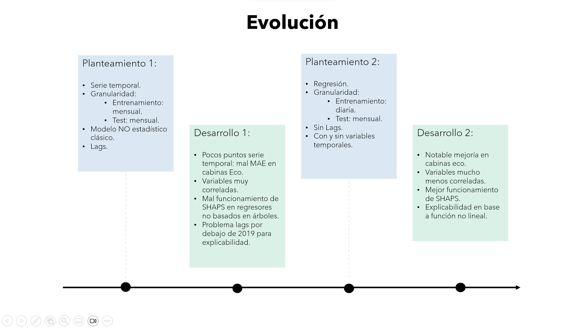

1. Adjusted vs raw. 
The performance comparison between using raw NPS data and weighted (and adjusted) data showed similar results. However, in terms of Economy cabins, which hold significant weight in the overall percentages, there was better performance observed with the adjusted data. Regarding the model trained with daily aggregated data, this experiment has not been conducted yet and should be considered in future iterations.

RAW monthly forecasts:
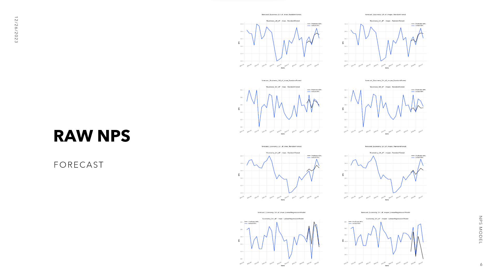
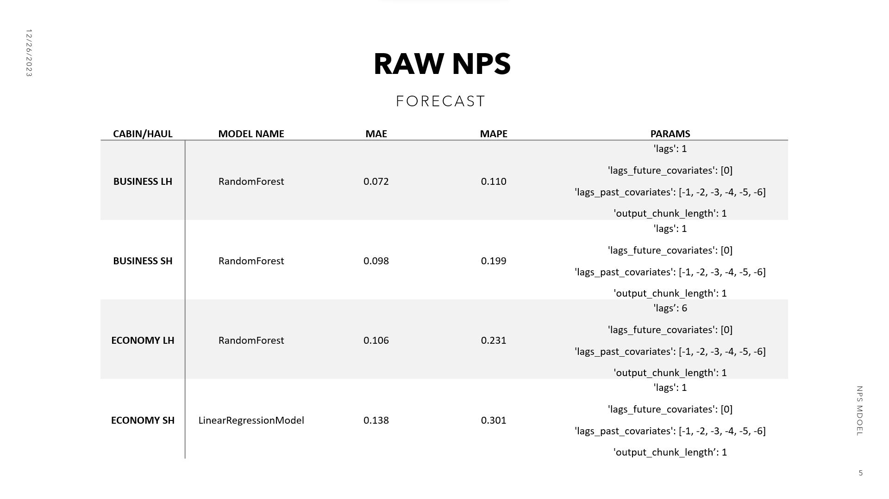
Ajusted monthly forecasts:
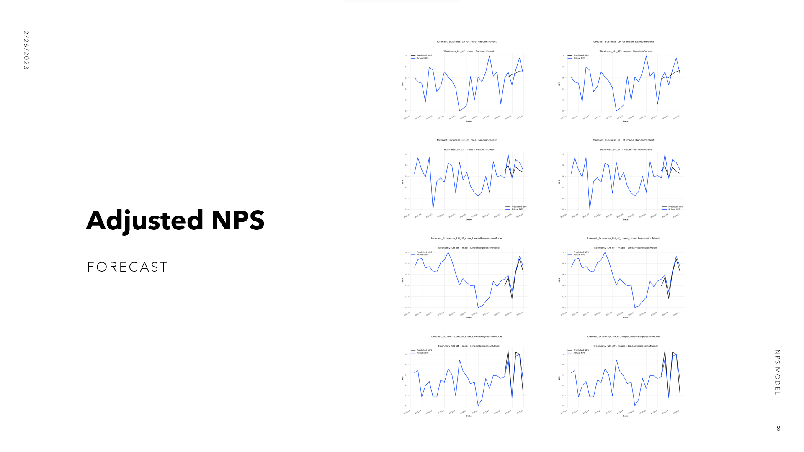
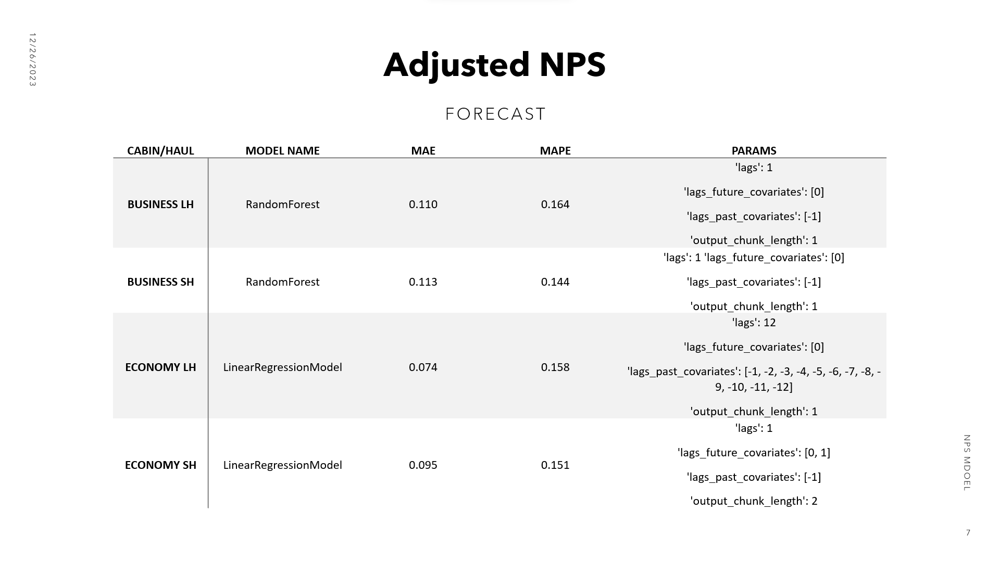

2. Time lags monthly aggregation. 
In the previous plots, it was ploted that forecasts extended six months into the future. To enhance model generalization, backtests for each model variant were conducted.

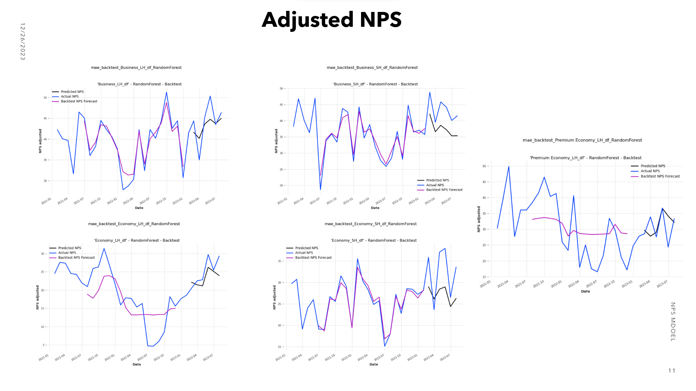

Despite tuning efforts, including the use of Optuna, the performance of the models remained suboptimal, particularly for less populated cabin categories. A notable challenge encountered was in the realm of explainability. Due to high correlation among variables at this level of aggregation, SHAP values did not align with expectations. 

For instance, let's consider the Long Haul Economy (LH ECO) cabin category. The correlation matrix for the variables used in this context is depicted below:
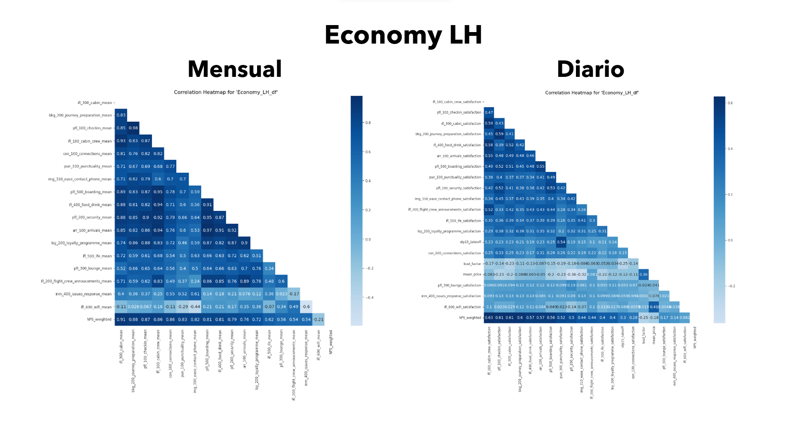
This correlation matrix provides insights into the relationships among the variables within the LH ECO cabin category.

To further illustrate the issue with SHAP values not aligning with our expectations, let's examine the backtest and forecast Mean Absolute Errors (MAEs) and the SHAP comparisons for the LH ECO cabin:
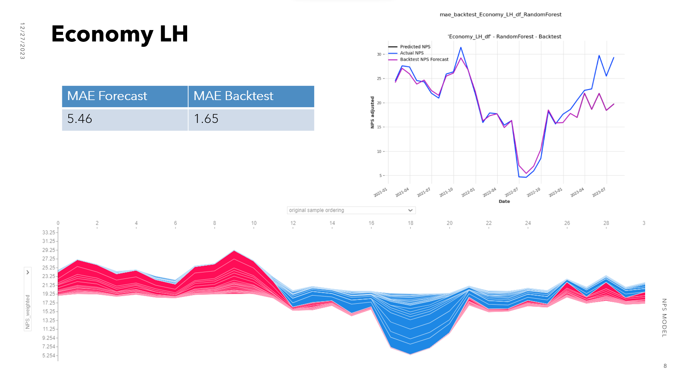
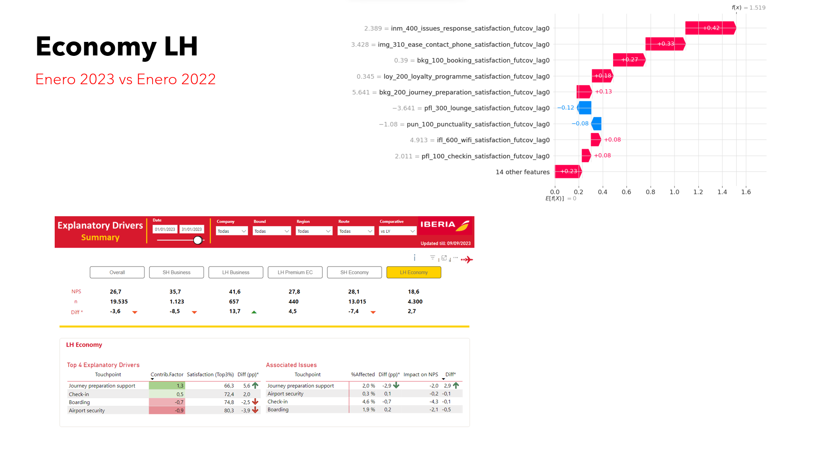
As observed in the above visualizations, the results were far from convincing, as the explanations provided by SHAP values did not align with the explanatory drivers shown in the current dashboard. These drivers were computed under the assumption of a linear relationship between the Net Promoter Score (NPS) and the variables, which allthough may not hold true given the complex correlations among the features in this specific cabin category, were taken as ground truth based on business knowledge.

3. Absence of lags. Daily vs weekly training. Monotonic constraints.
After conducting extensive experimentation and optimizing for Mean Absolute Error (MAE) through Optuna experiments, we concluded that daily aggregation was the most suitable approach for training our model. When using weekly aggregation, we observed stronger correlations between touchpoints, which led to inadequate performance of SHAP values.

To further fine-tune our model for the specific use case, we introduced monotonic constraints. These constraints were designed to ensure a direct or indirect relationship between each variable and the Net Promoter Score (NPS). While the introduction of monotonic constraints helped address some of the issues, it did not entirely resolve the problem of comparing SHAP values. In some cases, we observed negative impacts on positive changes in variables that had a direct relationship with NPS.

It's essential to note that this discrepancy arises because we are comparing importances rather than actual values. Even though the values of certain variables may be greater, their importance within the nonlinear model for a specific prediction can be lower. This importance is influenced by the values of other variables as well, making it a complex and context-dependent matter.

In nonlinear models, such as the one used in this scenario, the relationships between variables and the target (NPS) are not purely linear, and their impacts can vary significantly depending on the specific combination of input values. This complexity can make it challenging to interpret the importance of individual variables solely based on their values.

In summary, while the introduction of monotonic constraints improved our model's performance and interpretability to some extent, it's crucial to keep in mind that the interpretation of SHAP values in nonlinear models should consider the interplay of variables and their importance in specific prediction contexts.

The results for the previous example: 
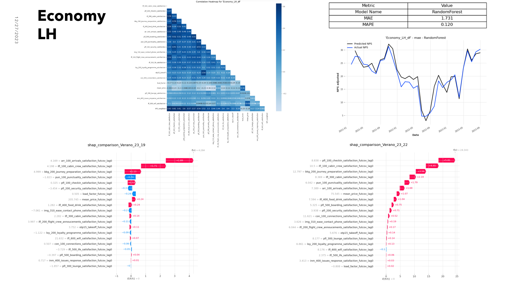
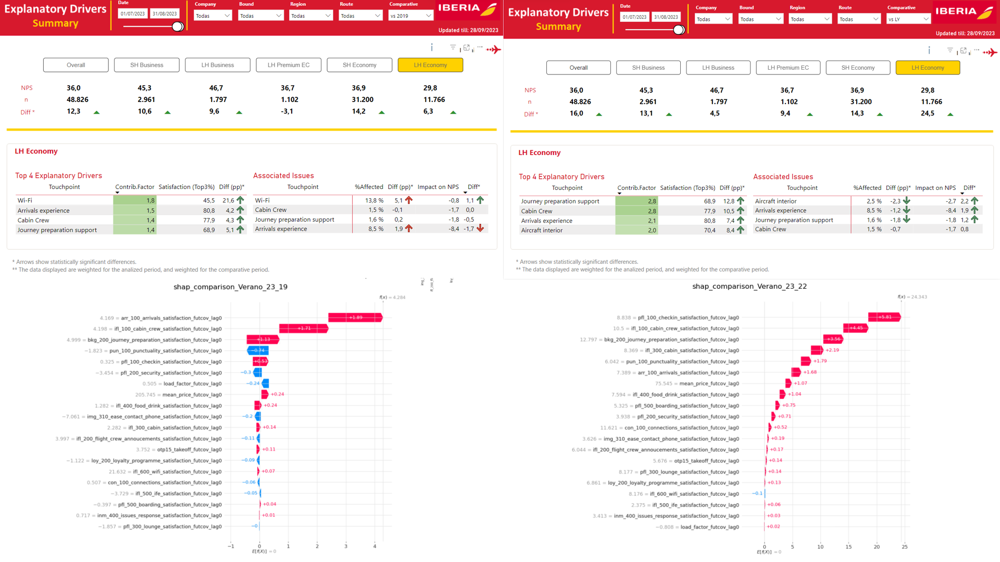

4. Aggregated model vs individual model. Simulation issue.
A comparison was conducted between the client model used in the previous iteration and the aggregated models employed in the current iteration. To perform this analysis, the actual monthly satisfaction data for 2023, pertaining to various touchpoints, was utilized to predict the corresponding Net Promoter Score (NPS). When considering only the touchpoint information and utilizing the client simulation from the previous iteration, the results of the aggregated models significantly outperformed the client-level model.
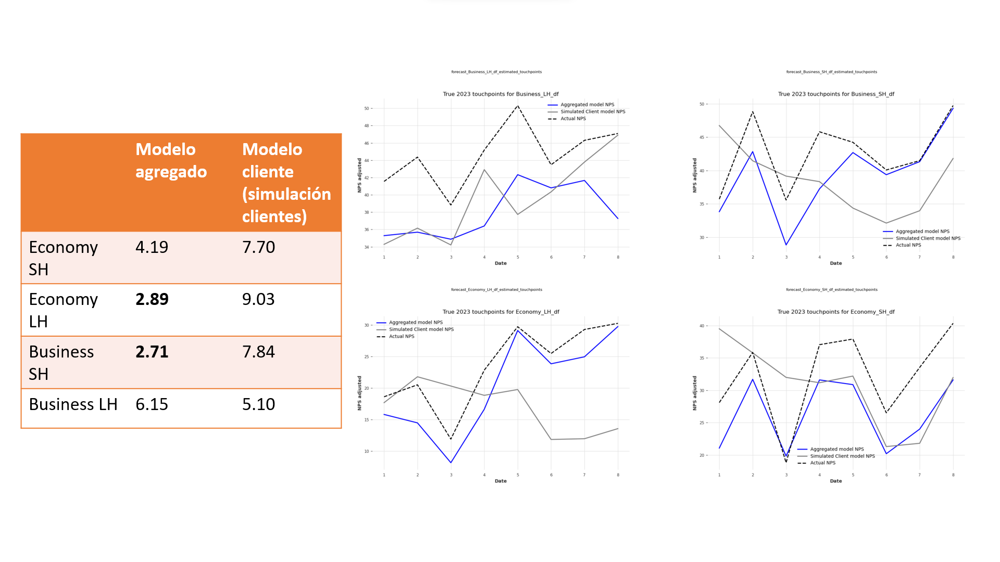

However, when accounting for the true distribution of clients across these months, the client-level model demonstrated superior performance to some of the aggregated models. 
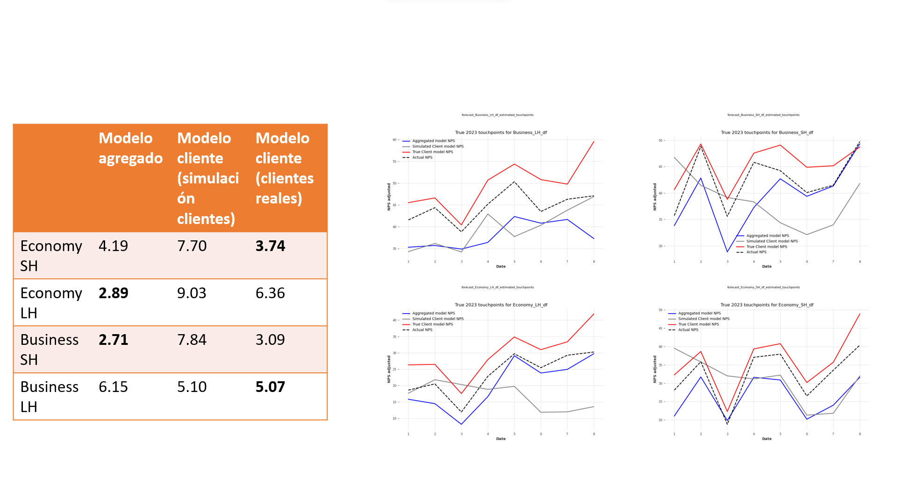

Consequently, our conclusion was that an improved method of simulation was necessary if we intended to make predictions based on a client-level model. Nevertheless, it's important to note that this type of model would offer greater flexibility, allowing us to make predictions for any segment.